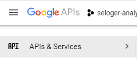
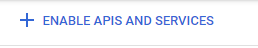
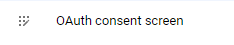
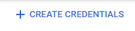

# Create the new google spreadsheet to have stats
1. Create an alert on Seloger.com to receive email on the criteria you would like using your gmail account adress : https://www.seloger.com/list.html?projects=2,5&types=1,2&natures=1,2,4&places=[{cp:75}]&price=NaN/150000&enterprise=0&qsVersion=1.0&m=search_advanced

Click on "Activer l'alerte"

2. Make a copy of https://docs.google.com/spreadsheets/d/1x4mTR-FdVc5dt7Lz5GAn-yL4SPXsVpJjNq0NQcB2V3E/edit?usp=sharing
This spreadsheet will be used to list all the statistics
3. Replace in Services/SheetService.cs the id of the Sheet you've just created :
    var spreadsheet = "1x4mTR-FdVc5dt7Lz5GAn-yL4SPXsVpJjNq0NQcB2V3E";

# Give access to Gmail & Google Spreadsheet to your app

4. Create a new Google Project to allow C# App accessing to Gmail & Google Spreedsheet : https://console.developers.google.com/projectcreate
5. Be sure you new project is selected and open api :

6. Enable APIs

7. Search for Gmail API => Enable
8. Search for Google Sheet API => Enable
9. Go to OAuth consent screen :

10. Create Consent Screen
11. User Type : External
12. Fill Mandatory Fields
13. Go to Credentials => Create Credentials :

14. Application Type : Desktop app
15. Create and you go back to the main screen 
16. Download the file :

17. Rename and copy it to : web-scraper\credentials\global.json

# Run it

18. Wait for alert being in your gmail box
19. Run web-scraper (Using VS Community 2019=>web-scraper.sln=>Press F5)
20. The first time it will prompt to use the google account
21. In App Security => Advanced => Go to "myproject(unsafe)" 
22. Review gmail access
23. Review spreadsheet access
24. Now scrapper should be running
24. Open the spreadsheet you should see the link
