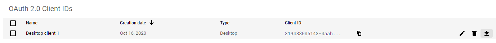

# Create the new google spreadsheet to have stats
1. Create an alert on Seloger.com to receive email on the criteria you would like using your gmail account adress : https://www.seloger.com/list.html?projects=2,5&types=1,2&natures=1,2,4&places=[{cp:75}]&price=NaN/150000&enterprise=0&qsVersion=1.0&m=search_advanced

Click on "Activer l'alerte"

Input the gmail address that will be used later

Subscribe to the alert

2. Make a copy of https://docs.google.com/spreadsheets/d/1x4mTR-FdVc5dt7Lz5GAn-yL4SPXsVpJjNq0NQcB2V3E/edit?usp=sharing
This spreadsheet will be used to list all the statistics

# Give access to Gmail & Google Spreadsheet to your app

4. Create a new Google Project to allow C# App accessing to Gmail & Google Spreedsheet : https://console.developers.google.com/projectcreate
5. Be sure you new project is selected and open api :

6. Enable APIs

7. Search for Gmail API => Enable
8. Search for Google Sheet API => Enable
9. Go to OAuth consent screen :

10. Create Consent Screen
11. User Type : External
12. Fill Mandatory Fields
13. Go to Credentials => Create Credentials :

14. Application Type : Desktop app
15. Create and you go back to the main screen 
16. Download the file :

# Run it the first time

17. Wait for alert being in your gmail box
18. Drag and drop the file for the credential you've download previously and set the url of the spreadsheet you've copy previously : 

19. Run baby ! Run !
20. Open the spreadsheet it should show you the summary of all ads (slowly...).

# Run in background

Run the app without UI by passing the URL of the spreadsheet as first arg of the app

